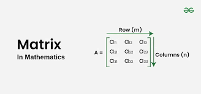

# MATRIX Transpose

## 

Welcome to the MATRIX Transpose project! This web application allows users to easily transpose both square and rectangular matrices directly in their browser. It's a simple and intuitive tool designed with responsiveness in mind, ensuring it works smoothly on devices of all sizes.

## 🚀 Live Preview

Check out the live version of the project [here](https://matrxzone.netlify.app/).

## 📦 Getting Started

To get started with this project locally, follow the steps below.

### 1. Clone the Repository

First, clone the repository to your local machine using Git:

```bash
git clone https://github.com/Nightstorm26/MATRIX-Transpose.git
```
### 2. open **index.html**

## Contributors

#### 22BCE10422	Riya Singh
#### 22BCE10879	Kaustubh Agrawal
#### 22BCE11389	Aryan Kumar Singh
#### 22BCE10881	Bidisha Biswas

